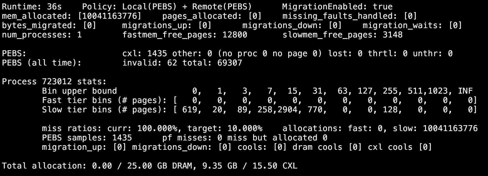

```
      ___          ___          ___          ___     
     /__/\        /  /\        /__/\        /  /\    
     \  \:\      /  /:/_      |  |::\      /  /::\   
      \  \:\    /  /:/ /\     |  |:|:\    /  /:/\:\  
  _____\__\:\  /  /:/ /:/_  __|__|:|\:\  /  /:/  \:\ 
 /__/::::::::\/__/:/ /:/ /\/__/::::| \:\/__/:/ \__\:\
 \  \:\~~\~~\/\  \:\/:/ /:/\  \:\~~\__\/\  \:\ /  /:/
  \  \:\  ~~~  \  \::/ /:/  \  \:\       \  \:\  /:/ 
   \  \:\       \  \:\/:/    \  \:\       \  \:\/:/  
    \  \:\       \  \::/      \  \:\       \  \::/   
     \__\/        \__\/        \__\/        \__\/    
```

# Nemo
NEMO is a hardware-software co-design research project that explores the design of a programmable memory controller and its supporting software.

> NEMO stands for **_Nimble_** and **_Expressive_** Memory Observability.

See our [design doc](./docs/design.md) for a description of the project's design.

See our [contributing doc](./CONTRIBUTING.md) for how to start contributing code to the project.

This repository is for the OSDI 2026 paper "Finding NEMO: Nimble and Expressive Memory Observability."
The artifact evaluation branch is [`osdi26_ae`](https://github.com/vic-lsh/nemo/tree/osdi26_ae).

## Directory structure

| Path | Purpose |
| --- | --- |
| `src/ucm/` | User-space central manager, memory-management policies, telemetry handling, and migration support. |
| `fpga/` | FPGA RTL, CXL Type-3 integration, simulation, and build scripts for the programmable memory controller. |
| `libs/` | Support libraries used by Nemo software, including CXL device and IPC utilities. |
| `apps/` | Application workloads used to evaluate Nemo. |
| `exp_scripts/` | Scripts for building and running application experiments. |
| `analysis/` | Analysis and plotting scripts for experiment results. |
| `platform/` | Docker, Linux, and QEMU platform support. |

## Getting started

By the end of this process, you should see a dashboard like the following:



### HW instructions

See [fpga/README.md](fpga/README.md).

### SW instructions

#### Preparing the system

First, pull all the submodules via `git submodule update --init --recursive`.

Next, run `./scripts/build/prepare.sh`. This prepares the server that you're running on for Nemo, including but not limited to: installing the Nemo-forked version of Linux, and installing build dependencies.

#### Building Nemo SW

Run:

```bash
# Create a config file inheriting the default feature flags.
# Feel free to change this in subsequent builds.
$ cp cmake/config.default cmake/config

# Set up CMake
$ cd build
$ cmake .. # run once

# Build the project
$ make -j$(nproc)
```

**Note: configuration options**: to see the list of available build-time configuration options, see `cmake/options.cmake`. Certain combinations of option configurations are not supported; for validation rules, see `cmake/validate_opts.cmake`.

#### Running application experiments

Nemo includes scripts to run applications it has tested with. The workflow is as follows:

```bash
$ sudo ./scripts/post_boot_setup.sh    # run once after server boots

$ sudo ./build/ucm         # start the central manager

# in a separate terminal
$ ./exp_scripts/<app>/<run_script_variant>
# as an example, running YCSB workload A on the application Faster
$ ./exp_scripts/faster/ycsb_run_a.sh
```

In general, applications need to be built first. Most applications should have a `build.sh` script under `./exp_scripts/<app-name>`.

#### Running Dockerized applications

See [Docker doc here](./platform/docker/README.md).

#### Running VM applications

See [VM doc here](./vm_exp/README.md).

## Credits

Nemo's software implementation started as as fork from HeMem and its extension FairMem (both can be found [in this repo](https://bitbucket.org/ajaustin/hemem/src/sosp-submission/)) See our [design doc](./docs/design.md) for a more in-depth discussion of how the project has evolved since then.
