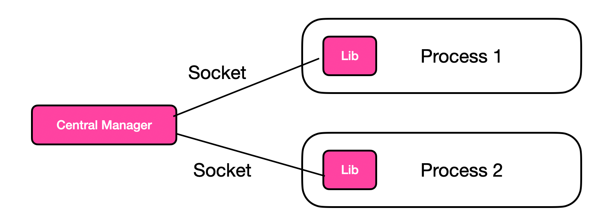
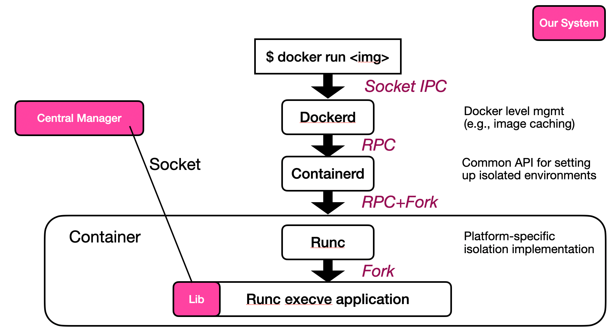
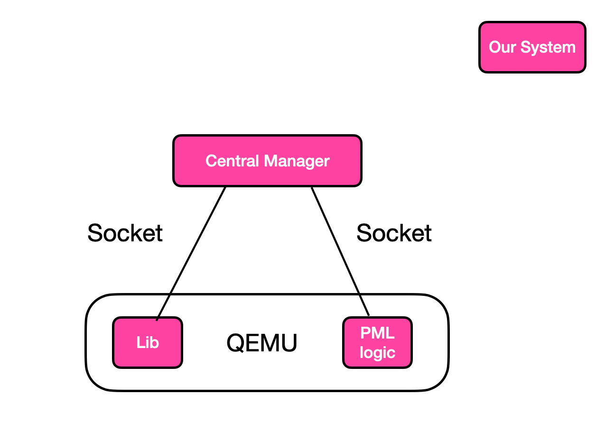

# Design Doc

This is an evolving document describing the design of NEMO: a hardware-software co-design research project that proposes a programmable memory controller, and the supporting software to leverage this programmability.

Currently, the design doc focuses on the software portion of the project.

## HW design

To be added once the design is more finalized.

## SW design

The software portion of the project started as a fork from the HeMem project (and its subsequent FairMem extension).

### SW architecture

The architecture of the SW components is as follows:

- A central daemon process, called the userspace central manager (ucm), centralizes memory management and policy decision making
- Applications run with a runtime loaded library, which intercepts and redirects memory allocations to be handled by the ucm

This architecture is inherited from the FairMem project.

### Application Platforms

Nemo supports managing processes, Docker containers, and VMs (running on KVM + QEMU).

#### Process

This architecture is inherited from FairMem. Nemo-managed processes load the Nemo library via `LD_PRELOAD`. After loaded, the Nemo library connects with the central manager via unix domain sockets.

Upon intercepting application memory allocation requests, the library forwards the request to the central manager, which logically allocates memory to the application. After receiving the allocation, the Nemo library actually makes the memory visible to the application via mmap, and listens to mapping changes via userfaultfd.

#### Docker Container

This architecture is an extension from the process-based setup above; Linux containers are implemented as Linux processes after all.

Additional complexities are as follows:

- Docker-based containers have complex orchestration logic, going through multiple processes such as `dockerd` and `containerd`. They can be unmodified from Nemo's point of view.
- Containers have dedicated namespaces (e.g., for PIDs) and root FS. Setup is required to make the central manager's socket, the Nemo library, and access to physical memory available within the container.

#### VM (on KVM + QEMU)

This architecture closely follows the process-based setup.

Because QEMU allocates large chunks of memory to VMs at VM boot time (often in GiBs), simply interposing on these memory requests is sufficient.

For implementation convenience, we added PML reading logic in our QEMU fork. In our fork, Nemo logic within QEMU would periodically write the VM's dirty bitmap to a memory region shared with the central manager.

### Design overview

Since the fork from FairMem, the project has been updated with the following goals in mind:

1. Make it easy to experiment with new telemetries (to better work with evolving FPGA-side telemetries)
2. Make it easy to change core policy decisions (e.g., where to allocate memory, when / what to migrate)

Following these goals, Nemo SW is organized with the following core components:

- **Telemetry**: responsible for reading telemetry updates and attributing them to Nemo-managed applications.
- **Policy**: responsible for implementing core policy decisions, such as where to allocate memory.
- Other core functionalities, such as memory management (`mm`), process management, and IPC with applications.

### Module: Telemetry

This module is responsible for reading telemetry updates from various sources, and attributing telemetry updates to Nemo-managed applications. You can find the source code under `src/ucm/telem`.

The telemetry module consists of two sub-modules: sources and handlers.

#### Telemetry sources

This submodule is responsible for gathering telemetry from different sources. Currently, the following sources are supported:

- Intel PEBS via the `perf` APIs
- FPGA counters (access counters now, more to follow)
- Dirty page bitmap via page modification logging (from QEMU, only available for VM applications)

This module should _only_ do telemetry gathering. It should defer all telemetry processing to the handlers, described below.

#### Telemetry handlers

The handler module implements various ways to process a telemetry gathered by the source module above.

Handlers are implemented as callback functions passed into the source module. See the following files for examples of the callback signature. We do not attempt to unify the callback API across telemetry sources, because each telemetry likely uses different data formats and require distinct APIs.

- [CXL access count update handler](https://github.com/vic-lsh/nemo/blob/771c08c98207d0a19ccdd8a712c7e29fcce7be86/src/ucm/telem/source/cxl.h#L7)
- [PEBS sample handler](https://github.com/vic-lsh/nemo/blob/771c08c98207d0a19ccdd8a712c7e29fcce7be86/src/ucm/telem/source/pebs.h#L40)

Handlers can interact with other Nemo subsystems (e.g., the process table and the list of allocated pages). This is unlike the sources module, which should refrain from interacting with other parts of Nemo.

Handler callbacks are a flexible way to experiment with different handling logic. For example, one handler could update page hotness based on PEBS samples, and another could update a LRU process list. Yet another handler could simply log the PEBS samples to a file for offline analysis.

To understand which handler is actually used, check which handler is actually passed into the telemetry source scanning functions. Currently, this logic resides in `src/ucm/core.c`.

### Module: Policy

The policy module centralizes decision making points within Nemo. It exposes a list of public APIs for other parts of Nemo to invoke on. This list of API is defined in [`src/ucm/policy/policy.h`](https://github.com/vic-lsh/nemo/blob/main/src/ucm/policy/policy.h).

Internally, Nemo allows multiple policy implementations to co-exist. At startup time, Nemo instantiates one such policy based on build or runtime configurations.

Each policy implementation must implement the `policy_t` interface, defined in [`ucm/policy/policy-interface.h`](https://github.com/vic-lsh/nemo/blob/main/src/ucm/policy/policy-interface.h). Observant readers would note that this interface closely matches the APIs in `policy/policy.h`; indeed, the public-facing policy functions are but thin wrappers for the instantiated policy implementation, which implements `policy_t`.

`policy_t` contains an opaque pointer. This is a type-erased pointer that can point to implementation-defined, Nemo-global policy state. This pointer would be provided as an argument to all policy functions in `policy_t`.

Nemo also supports storing process-local policy state. This state is currently defined in `struct process_policy` in `src/ucm/policy-state.h`. In the future, this state will be an opaque pointer pointing to implementation-defined state structs, similar to the one in `policy_t`.

### Other core modules

Nemo includes many other modules that collaborate to manage memory for multiple applications. These include:

- `physmem` (`src/ucm/physmem/*`): This module manages how Nemo obtains an initial memory pool, from which it allocates memory to applications. Currently, it supports DAX files (for realistic, multi-tier setup) and Posix shared-memory regions (for correctness testing on commdity servers).
- `ipc` (`src/ucm/ipc`): for sending and receiving messages with the application-side library
- `mm`: manages which memory pages have been allocated. `mm-async` defers certain processing to be pick up asynchronously.
- `proc-mgr`: manages processes.
- `uffd`: handles various types of userfaultfd faults, which is crucial for Nemo's memory interposition and page migration.